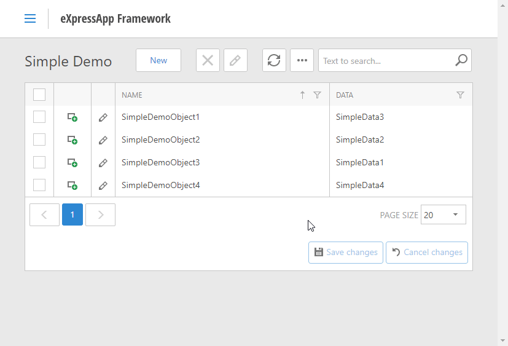
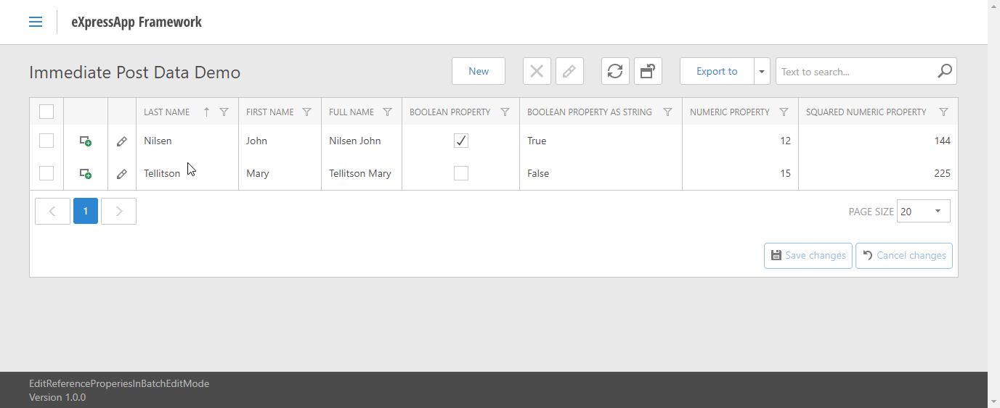
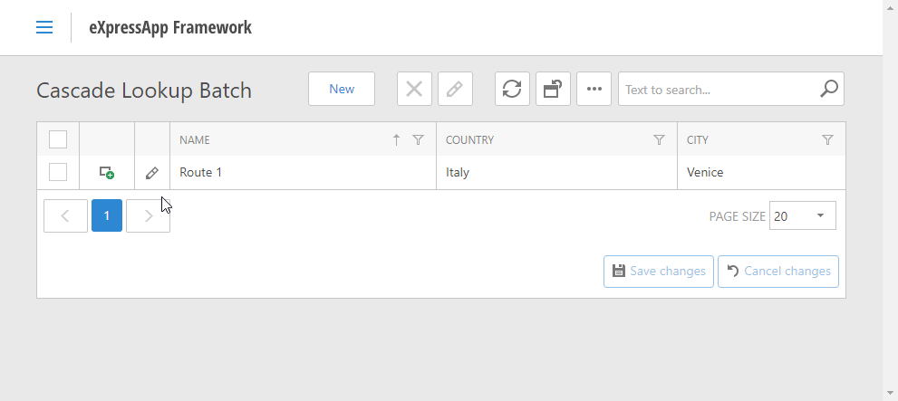
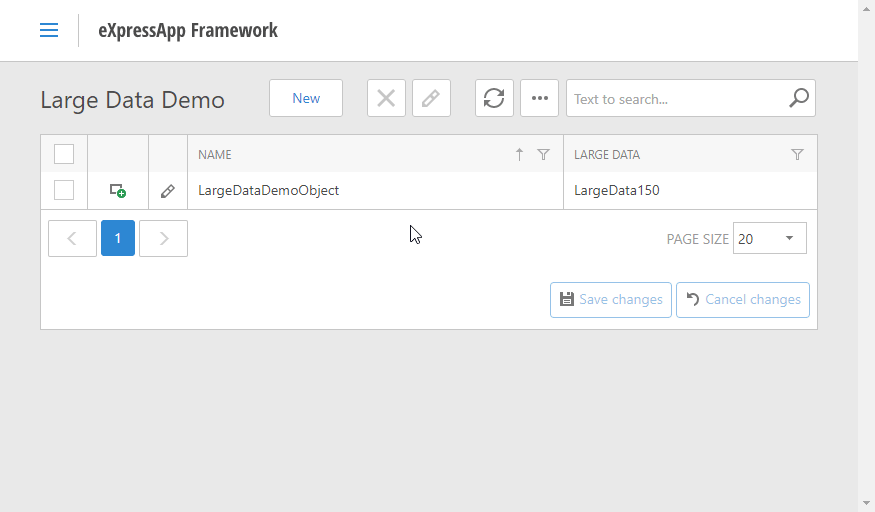

# Reference properties in ASPxGridView's Batch Edit mode - Early Access Preview v19.2

We've supported lookup editors for reference properties Batch Edit List Views. Starting with v19.2, the code-based solution described in the <a href="https://docs.devexpress.com/eXpressAppFramework/115835/task-based-help/list-editors/how-to-edit-a-reference-property-in-the-batch-edit-mode">How to: Edit a Reference Property in the Batch Edit Mode</a> topic is not required. Lookup editors are shown out of the box.

The demo provides four navigation items:

## Lookup editor for reference property:

This item illustrates a simple lookup.

## The ImmediatePostData attribute:

This item illustrates how the [ImmediatePostData](https://docs.devexpress.com/eXpressAppFramework/DevExpress.Persistent.Base.ImmediatePostDataAttribute) attribute works in Batch Edit lookups. The ListView's calculated properties (FullName, BooleanPropertyAsString, SquaredNumberProperty) are updated immediately after changing the lookup property.

## Cascading Properties:

The item illustrates how [Cascading Filtering for Lookup List Views](https://docs.devexpress.com/eXpressAppFramework/112681/Task-Based-Help/Filtering/How-to-Implement-Cascading-Filtering-for-Lookup-List-Views) works in Batch Edit mode. The ListView has two lookup properties: Country and City. The City lookup items are populated based on the value selected in the Country lookup.

## Large Data Source:
This item shows how the lookup editor handles large data sources. The demonstrated lookup has 100000 rows, and [Server mode](https://docs.devexpress.com/eXpressAppFramework/113683/Concepts/UI-Construction/Views/List-View-Data-Access-Modes) is enabled in its model.

